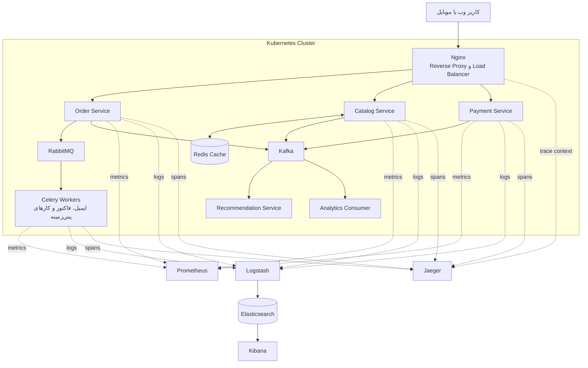

# پاسخ تمرین چهارم درس سیستم‌های توزیع‌شده

## بخش نظری

## ۱. تعریف مفاهیم

### ۱-۱. Domain Coupling

وابستگی دامنه‌ای زمانی ایجاد می‌شود که انجام یک کار در یک بخش از سیستم، به دانستن جزئیات یا اجرای منطق یک بخش دیگر وابسته باشد. برای مثال اگر سرویس سفارش برای ثبت سفارش مجبور باشد ساختار داخلی سرویس انبار و روش محاسبه موجودی آن را بداند، بین این دو سرویس وابستگی دامنه‌ای ایجاد شده است. اصل وجود این وابستگی همیشه بد نیست، چون بخش‌های یک کسب‌وکار طبیعتاً با هم ارتباط دارند؛ مسئله از جایی شروع می‌شود که این ارتباط آن‌قدر زیاد شود که تغییر یک قانون در انبار، سرویس سفارش را هم مجبور به تغییر کند.

در طراحی مناسب باید این وابستگی‌ها تا حد ممکن از طریق قراردادهای مشخص مانند API یا رویداد بیان شوند. همچنین هر قانون کسب‌وکار بهتر است در همان سرویسی قرار بگیرد که مالک آن مفهوم است. با این کار سرویس‌ها به جای وابستگی به جزئیات داخلی یکدیگر، فقط به یک قرارداد پایدار وابسته می‌شوند.

### ۱-۲. Data Decomposition

تجزیه داده یعنی داده‌های سیستم را بر اساس مسئولیت‌های کسب‌وکار بین بخش‌های مختلف تقسیم کنیم. در معماری میکروسرویس، معمولاً هر سرویس مالک داده‌های مربوط به دامنه خودش است. مثلاً سرویس کاربران اطلاعات پروفایل را نگه می‌دارد، سرویس سفارش مالک سفارش‌هاست و سرویس پرداخت تراکنش‌های مالی را ذخیره می‌کند.

نکته مهم این است که این تقسیم‌بندی صرفاً جدا کردن چند جدول یا ساختن چند دیتابیس نیست. مرز داده باید از مرز دامنه پیروی کند. سرویس دیگر نباید مستقیماً جدول‌های یک سرویس را بخواند، بلکه باید داده مورد نیازش را از API یا رویدادهای آن سرویس بگیرد. نتیجه این کار استقلال بیشتر سرویس‌هاست، هرچند انجام گزارش‌های سراسری و حفظ سازگاری داده‌ها کمی پیچیده‌تر می‌شود.

### ۱-۳. Event-Driven Communication Pattern

در الگوی ارتباط رویدادمحور، یک سرویس وقوع یک اتفاق را اعلام می‌کند و لازم نیست بداند چه سرویس‌هایی به آن واکنش نشان می‌دهند. مثلاً سرویس سفارش بعد از ثبت موفق خرید، رویداد «سفارش ثبت شد» را منتشر می‌کند. سرویس اعلان می‌تواند با دریافت آن ایمیل بفرستد و سرویس تحلیل داده نیز همان رویداد را برای گزارش فروش مصرف کند.

این ارتباط معمولاً به کمک یک Message Broker مانند Kafka یا RabbitMQ انجام می‌شود. مزیت اصلی آن کاهش وابستگی مستقیم و امکان پردازش ناهمگام است. در مقابل، دنبال کردن مسیر یک درخواست و مدیریت خطا سخت‌تر می‌شود و باید مواردی مانند تحویل تکراری پیام، ترتیب رویدادها، idempotency و سازگاری نهایی داده‌ها از ابتدا در طراحی دیده شوند.

## ۲. مشکل عملکرد فروشگاه آنلاین

مشکل اصلی این سناریو «ریز کردن زودهنگام سیستم» یا Premature Decomposition است. تیم قبل از آنکه دامنه و مرز واقعی قابلیت‌های کسب‌وکار را بشناسد، سیستم را به تعداد زیادی سرویس کوچک تقسیم کرده است. نتیجه چنین تصمیمی معمولاً یک Distributed Monolith است؛ یعنی سیستم روی کاغذ از سرویس‌های مستقل تشکیل شده، اما در عمل سرویس‌ها برای انجام یک قابلیت ساده به چندین فراخوانی متوالی و تغییر هماهنگ وابسته‌اند.

میکروسرویس فقط زمانی ارزش هزینه‌هایش را دارد که استقلال استقرار، مقیاس‌پذیری جداگانه یا استقلال تیم‌ها واقعاً مورد نیاز باشد. در این پروژه هنوز چنین نیازی وجود نداشته، ولی تیم از همان ابتدا هزینه‌های شبکه، کشف سرویس، مدیریت چند دیتابیس، مانیتورینگ توزیع‌شده، سازگاری نهایی و تست End-to-End را پذیرفته است. هر مرز سرویس نیز یک نقطه شکست تازه ساخته؛ بنابراین افزایش latency، باگ‌های مرزی و کند شدن تحویل قابلیت‌ها قابل انتظار است.

وابستگی شدید APIها نشانه دیگری است که مرزها بر اساس دامنه انتخاب نشده‌اند. اگر برای اضافه کردن یک فیلد یا تغییر یک قانون ساده لازم باشد چند سرویس با هم منتشر شوند، استقلال واقعی به دست نیامده است. دیتابیس جداگانه هم به تنهایی این مشکل را حل نمی‌کند و حتی ممکن است تراکنشی را که قبلاً محلی و ساده بود، به یک تراکنش توزیع‌شده تبدیل کند.

رویکرد مناسب‌تر برای شروع، یک Modular Monolith بود. در این روش برنامه یک واحد قابل استقرار است، اما داخل آن ماژول‌هایی با مرز روشن مانند کاتالوگ، سفارش، پرداخت و انبار دارد. هر ماژول API داخلی مشخص دارد و حق دسترسی دلخواه به منطق ماژول دیگر را ندارد. این ساختار هم توسعه و تست اولیه را ساده نگه می‌دارد و هم اجازه می‌دهد شناخت تیم از دامنه به مرور کامل شود.

پس از مشخص شدن Bounded Contextها و مشاهده نیاز واقعی، می‌توان سرویس‌هایی را که دلیل خوبی برای استقلال دارند به تدریج جدا کرد. مثلاً اگر پردازش پرداخت الزامات امنیتی و چرخه انتشار مستقلی پیدا کرد یا کاتالوگ در کمپین‌ها بار بسیار بیشتری گرفت، جدا کردن آن‌ها منطقی می‌شود. این جداسازی تدریجی با الگوی Strangler انجام می‌شود و بسیار کم‌ریسک‌تر از تقسیم کامل سیستم در روز اول است.

## ۳. مقایسه ارتباط همگام و ناهمگام

در ارتباط همگام، سرویس درخواست‌کننده منتظر پاسخ سرویس مقصد می‌ماند. REST و gRPC نمونه‌های رایج این روش هستند. فهم مسیر اجرای کار ساده‌تر است و وقتی نتیجه باید همان لحظه به کاربر نشان داده شود، انتخاب مناسبی محسوب می‌شود. در عوض، زمان پاسخ کل برابر با مجموع تأخیر فراخوانی‌ها می‌شود و خرابی سرویس مقصد می‌تواند مستقیماً درخواست کاربر را متوقف کند.

در ارتباط ناهمگام، سرویس پیام یا رویداد را در Broker قرار می‌دهد و بدون انتظار برای پایان کار مصرف‌کننده به مسیر خود ادامه می‌دهد. مصرف‌کننده هر زمان آماده باشد پیام را پردازش می‌کند. این روش سرویس‌ها را از نظر زمانی از هم جدا می‌کند و افزایش تعداد مصرف‌کننده‌ها نیز ساده‌تر است، اما نتیجه فوری نیست و مدیریت retry، پیام تکراری، صف خطا و مشاهده مسیر اجرای درخواست اهمیت پیدا می‌کند.

مقایسه این دو روش بر اساس معیارهای سؤال به شکل زیر است:

| معیار | ارتباط همگام | ارتباط ناهمگام |
|---|---|---|
| Coupling | فرستنده مقصد و قرارداد پاسخ را می‌شناسد و از نظر زمانی هم به در دسترس بودن آن وابسته است. | تولیدکننده فقط قرارداد پیام را می‌شناسد و لازم نیست مصرف‌کنندگان را بشناسد. |
| Latency | نتیجه سریع و مستقیم برمی‌گردد، ولی زنجیره فراخوانی‌ها تأخیر را جمع می‌کند. | فرستنده سریع آزاد می‌شود، اما زمان تکمیل نهایی کار قابل پیش‌بینی و فوری نیست. |
| Fault Tolerance | خرابی مقصد مستقیماً روی درخواست اثر می‌گذارد و به timeout و circuit breaker نیاز است. | Broker پیام را تا زمان بازیابی مصرف‌کننده نگه می‌دارد؛ البته خود Broker هم باید پایدار و تکرارشده باشد. |
| Scalability | می‌توان نمونه‌های سرویس را زیاد کرد، ولی ترافیک لحظه‌ای مستقیماً به آن‌ها منتقل می‌شود. | صف نقش بافر دارد و مصرف‌کننده‌ها می‌توانند مستقل و بر اساس حجم صف مقیاس بگیرند. |
| سازگاری | برای عملیات نیازمند پاسخ فوری و سازگاری قوی ساده‌تر است. | معمولاً با سازگاری نهایی کار می‌کند و مشاهده نتیجه با کمی تأخیر انجام می‌شود. |

برای سناریوی مطرح‌شده، یک انتخاب ترکیبی بهتر از اجبار کل فرایند به استفاده از تنها یکی از این دو روش است. هنگام پرداخت، کاربر باید همان لحظه بفهمد پرداخت پذیرفته شده یا نه؛ بنابراین سرویس سفارش می‌تواند درخواست پرداخت را به صورت همگام بفرستد. این فراخوانی باید timeout کوتاه، کلید idempotency و circuit breaker داشته باشد تا تکرار درخواست باعث دوبار پرداخت شدن نشود و خرابی سرویس پرداخت نیز منابع سرویس سفارش را برای مدت طولانی درگیر نکند.

بعد از ثبت نتیجه پرداخت، ارسال ایمیل بخشی از پاسخ اصلی کاربر نیست. سرویس سفارش یا پرداخت رویداد OrderPaid را منتشر می‌کند و سرویس اعلان آن را از Broker می‌گیرد. در این حالت حتی اگر سرویس ایمیل موقتاً قطع باشد، خرید کاربر از بین نمی‌رود و ایمیل بعد از بازیابی ارسال می‌شود. برای جلوگیری از حالتی که تراکنش دیتابیس ثبت شود ولی انتشار رویداد شکست بخورد، می‌توان از الگوی Transactional Outbox استفاده کرد.

اگر کسب‌وکار اجازه دهد پرداخت نیز کاملاً ناهمگام باشد، سفارش ابتدا با وضعیت Pending ساخته می‌شود و نتیجه بعداً با رویداد PaymentSucceeded یا PaymentFailed برمی‌گردد. این روش در بار زیاد مقاوم‌تر است، ولی رابط کاربری باید انتظار و تغییر وضعیت را به‌خوبی مدیریت کند. در نتیجه انتخاب نهایی به نیاز کسب‌وکار وابسته است: عملیات تعاملی و کوتاه معمولاً همگام، و کارهای جانبی، طولانی یا قابل صف‌بندی معمولاً ناهمگام هستند.

## ۴. طراحی سامانه میکروسرویس پلتفرم آموزشی

### مرز سرویس‌ها و مسئولیت آن‌ها

مرز سرویس‌ها را بر اساس Bounded Contextهای کسب‌وکار در نظر می‌گیرم، نه بر اساس موجودیت‌هایی مثل «یک سرویس برای هر جدول». سرویس‌های اصلی پیشنهادی عبارت‌اند از:

| سرویس | مسئولیت و داده‌های تحت مالکیت |
|---|---|
| هویت و کاربران | ثبت‌نام، ورود، نقش دانشجو و مدرس، پروفایل و مجوزها؛ مالک اطلاعات حساب کاربری است. |
| کاتالوگ دوره | مشخصات دوره، مدرس، دسته‌بندی، قیمت پایه و وضعیت انتشار؛ مالک اطلاعات قابل جست‌وجوی دوره است. |
| محتوا | فصل‌ها، ویدئوها و فایل‌های دوره؛ فایل اصلی را در Object Storage نگه می‌دارد و دسترسی امن به CDN صادر می‌کند. |
| ثبت‌نام و خرید | سبد خرید، سفارش و دسترسی دانشجو به دوره؛ مالک وضعیت Enrollment است. |
| پرداخت | ارتباط با درگاه، ثبت تلاش‌های پرداخت، بازگشت وجه و نتیجه تراکنش مالی. |
| یادگیری و ارزیابی | پیشرفت تماشای درس‌ها، تمرین‌ها، پاسخ دانشجو و نمره؛ داده‌های پرتعداد فعالیت آموزشی را نگه می‌دارد. |
| گواهی | بررسی شرایط پایان دوره و تولید گواهی قابل اعتبارسنجی. |
| امتیاز و دیدگاه | ثبت امتیاز و نظر کاربران مجاز و محاسبه امتیاز تجمیعی هر دوره. |
| اعلان | ارسال ایمیل، پیامک یا اعلان درون‌برنامه‌ای بر اساس رویدادها. |
| پیشنهاد دوره | ساخت پیشنهاد شخصی بر اساس بازدید، خرید و پیشرفت کاربر. |

این فهرست به معنی آن نیست که از روز اول باید ده مخزن و ده تیم جدا داشته باشیم. چند Context کم‌بار را می‌توان ابتدا در یک واحد قابل استقرار نگه داشت، ولی مرز کد و مالکیت داده آن‌ها را حفظ کرد و فقط در صورت نیاز عملی جدا نمود.

### مالکیت و تبادل داده

هر سرویس دیتابیس خصوصی خودش را دارد و سرویس دیگر اجازه خواندن مستقیم جدول‌های آن را ندارد. برای مثال، مرجع قطعی دسترسی یک دانشجو به دوره در سرویس ثبت‌نام است و سرویس محتوا برای بررسی مجوز، از قرارداد آن سرویس استفاده می‌کند. اطلاعاتی که زیاد خوانده می‌شوند می‌توانند با رویداد در سرویس مقصد تکرار شوند؛ مثلاً سرویس پیشنهاد با مصرف رویداد CourseViewed یک مدل خواندنی مخصوص خودش می‌سازد. این تکرار کنترل‌شده بهتر از دیتابیس مشترک است، چون استقلال سرویس‌ها را حفظ می‌کند.

### ارتباط بین سرویس‌ها

فراخوانی‌های نیازمند پاسخ فوری به صورت همگام انجام می‌شوند. ورود کاربر، دریافت فهرست دوره‌ها، گرفتن لینک پخش و شروع پرداخت نمونه این موارد هستند. مسیر ورودی از API Gateway عبور می‌کند تا احراز هویت اولیه، rate limiting و مسیریابی در یک نقطه انجام شود. برای جلوگیری از زنجیره‌های طولانی، Gateway وظیفه اجرای منطق کسب‌وکار را بر عهده نمی‌گیرد.

اتفاق‌های کسب‌وکاری به صورت رویداد منتشر می‌شوند. نمونه‌های مهم عبارت‌اند از CoursePublished، OrderCreated، PaymentSucceeded، EnrollmentActivated، LessonCompleted و CourseCompleted. سرویس اعلان، پیشنهاد و گواهی این رویدادها را مستقل مصرف می‌کنند. قرارداد رویدادها باید نسخه‌بندی شود و هر مصرف‌کننده در برابر دریافت تکراری یک رویداد idempotent باشد.

### تراکنش خرید دوره

خرید یک دوره بین سرویس ثبت‌نام و پرداخت پخش شده و با تراکنش ACID سراسری اجرا نمی‌شود. برای این فرایند یک Saga در نظر می‌گیرم:

1. سرویس ثبت‌نام سفارش را با وضعیت Pending ایجاد می‌کند.
2. سرویس پرداخت با یک کلید idempotency تراکنش را در درگاه انجام می‌دهد.
3. در صورت موفقیت، رویداد PaymentSucceeded منتشر می‌شود و ثبت‌نام به Active تغییر می‌کند.
4. در صورت شکست، سفارش Failed می‌شود. اگر پول دریافت شده باشد ولی فعال‌سازی دوره بعد از چند تلاش انجام نشود، عمل جبرانی Refund آغاز می‌شود.
5. پس از فعال شدن ثبت‌نام، اعلان رسید و دسترسی دوره به شکل ناهمگام انجام می‌شود.

هر سرویس تغییر دیتابیس و ثبت پیام Outbox را در یک تراکنش محلی انجام می‌دهد. پردازش جداگانه پیام را از Outbox به Broker می‌فرستد. به این شکل بین ذخیره داده و انتشار رویداد شکاف ایجاد نمی‌شود.

### مقیاس‌پذیری و پایداری

سرویس‌ها تا حد ممکن stateless هستند تا بتوان برای آن‌ها چند نمونه اجرا کرد. در زمان انتشار یک دوره محبوب، کاتالوگ، محتوا و احراز دسترسی می‌توانند جداگانه مقیاس بگیرند، بدون آنکه سرویس گواهی نیز بی‌دلیل بزرگ شود. ویدئو مستقیماً از Object Storage و CDN تحویل می‌شود و از داخل Pod سرویس عبور نمی‌کند. داده‌های داغ مانند صفحه دوره‌های محبوب با TTL کوتاه cache می‌شوند.

برای فراخوانی‌های همگام timeout، retry محدود با backoff و circuit breaker لازم است. برای رویدادها نیز retry و Dead Letter Queue در نظر گرفته می‌شود. معیارهایی مانند نرخ خطا، زمان پاسخ و طول صف پایش می‌شوند و شناسه trace در درخواست‌ها و پیام‌ها منتقل می‌شود تا یک فرایند بین چند سرویس قابل دنبال کردن باشد.

## بخش پژوهشی

## ۵. ابزارهای مهم

### الف) Nginx

Nginx یک وب‌سرور و Reverse Proxy سبک است که می‌تواند در ورودی سامانه قرار بگیرد. درخواست HTTPS را دریافت می‌کند، فایل‌های ایستا را تحویل می‌دهد و درخواست API را بر اساس مسیر به سرویس مناسب می‌فرستد. همچنین می‌تواند ترافیک را بین چند نمونه از یک سرویس توزیع کند.

مثال عملی آن در یک فروشگاه پربازدید است: درخواست‌های /api/catalog بین سه نمونه سرویس کاتالوگ پخش می‌شوند، در حالی که /api/payment به نمونه‌های سرویس پرداخت می‌رود. در نتیجه کاربر فقط یک آدرس عمومی می‌بیند و تغییر تعداد نمونه‌های داخلی برای او مشخص نیست.

### ب) Prometheus

Prometheus ابزار جمع‌آوری و پایش metricهای سری زمانی است. سرویس‌ها عددهایی مانند تعداد درخواست، نرخ خطا، زمان پاسخ و مصرف حافظه را در یک endpoint ارائه می‌کنند و Prometheus در فاصله‌های زمانی مشخص آن‌ها را جمع‌آوری می‌کند. سپس می‌توان روی این داده‌ها query و alert تعریف کرد.

برای مثال اگر صدک ۹۵ زمان پاسخ سرویس پرداخت طی پنج دقیقه از دو ثانیه بیشتر شود، Prometheus می‌تواند هشدار را به Alertmanager بفرستد. تیم عملیات با دیدن هم‌زمان نرخ خطا و مصرف CPU تشخیص می‌دهد مشکل از کمبود منابع است یا از درگاه بانکی.

### پ) RabbitMQ

RabbitMQ یک Message Broker مناسب برای صف کار و مسیریابی پیام است. تولیدکننده پیام را به Exchange می‌فرستد و Exchange بر اساس binding و routing key آن را به یک یا چند صف هدایت می‌کند. تأیید دریافت، صف پایدار، retry و Dead Letter Exchange باعث می‌شوند کارهای مهم با خرابی موقت مصرف‌کننده از بین نروند.

یک مثال واقعی، صف ارسال ایمیل پس از خرید است. سرویس سفارش پیام را در صف قرار می‌دهد و چند Worker ایمیل‌ها را مصرف می‌کنند. اگر سرویس ایمیل برای چند دقیقه قطع شود، سفارش‌ها همچنان ثبت می‌شوند و پیام‌ها تا زمان برگشت Worker در صف می‌مانند.

### ت) Celery

Celery یک Task Queue توزیع‌شده برای برنامه‌های پایتون است. خود Celery محل نگهداری پیام نیست و برای جابه‌جایی task به Brokerهایی مانند RabbitMQ یا Redis متکی است. Workerهای Celery می‌توانند کارهای زمان‌بر یا زمان‌بندی‌شده را بیرون از مسیر پاسخ HTTP اجرا کنند.

برای مثال پس از پایان دوره، API فقط درخواست ساخت گواهی را ثبت می‌کند. یک Worker در پس‌زمینه PDF گواهی را می‌سازد، آن را در فضای فایل ذخیره می‌کند و نتیجه را برمی‌گرداند. با زیاد شدن درخواست‌ها می‌توان تعداد Workerها را افزایش داد، بدون آنکه نمونه‌های API را بی‌دلیل زیاد کنیم.

### ث) ELK

ELK از Elasticsearch، Logstash و Kibana تشکیل شده است. Logstash لاگ سرویس‌ها را دریافت و ساخت‌یافته می‌کند، Elasticsearch آن‌ها را index می‌کند و Kibana امکان جست‌وجو و ساخت داشبورد را می‌دهد. در استقرارهای جدید معمولاً یک جمع‌کننده سبک مانند Filebeat نیز لاگ کانتینرها را برای این مسیر ارسال می‌کند.

مثلاً وقتی کاربری گزارش می‌دهد پرداخت او موفق بوده ولی سفارش فعال نشده است، پشتیبان با جست‌وجوی order_id یا trace_id در Kibana، لاگ سرویس سفارش و پرداخت را کنار هم می‌بیند و نقطه شکست را پیدا می‌کند. این کار بسیار سریع‌تر از ورود جداگانه به هر سرور و خواندن فایل لاگ است.

### ج) Redis

Redis یک مخزن داده سریع در حافظه است که بیشتر برای cache، session، شمارنده، rate limiting و داده‌های کوتاه‌عمر استفاده می‌شود. استفاده از TTL و سیاست حذف کلیدها مهم است، چون cache نباید بدون محدودیت حافظه را پر کند. Redis جای دیتابیس اصلی داده‌های مالی نیست، مگر اینکه دوام و مدل داده آن آگاهانه برای همان نیاز طراحی شده باشد.

در یک پلتفرم آموزشی، مشخصات دوره‌های محبوب با الگوی Cache-Aside برای چند دقیقه در Redis قرار می‌گیرد. در کمپین، بیشتر درخواست‌ها از cache پاسخ می‌گیرند و فشار روی دیتابیس کاتالوگ کم می‌شود. پس از ویرایش دوره نیز کلید مربوط حذف می‌شود تا اطلاعات قدیمی مدت زیادی نمایش داده نشود.

### چ) Kubernetes

Kubernetes بستر مدیریت workloadهای کانتینری است. وضعیت مطلوب استقرار را تعریف می‌کنیم و Kubernetes اجرای Podها، جایگزینی نمونه خراب، Service Discovery، rollout نسخه جدید و مدیریت تنظیمات را انجام می‌دهد. Horizontal Pod Autoscaler نیز می‌تواند تعداد نمونه‌های یک workload را بر اساس مصرف منابع یا metric مناسب تغییر دهد.

مثلاً هنگام شروع یک کمپین، تعداد Podهای سرویس کاتالوگ از ۳ به ۱۵ افزایش پیدا می‌کند، اما سرویس کم‌مصرف گواهی روی همان ۲ Pod می‌ماند. اگر یک Pod از کار بیفتد، Deployment نمونه دیگری ایجاد می‌کند و Service ترافیک را فقط به Podهای آماده می‌فرستد.

### ح) Kafka

Kafka یک پلتفرم Event Streaming توزیع‌شده است. رویدادها را به شکل پایدار در Topicهای پارتیشن‌بندی‌شده نگه می‌دارد و چند گروه مصرف‌کننده می‌توانند هرکدام همان جریان را با سرعت خودشان پردازش کنند. تفاوت مهم آن با یک صف کار معمولی این است که رویداد پس از مصرف فوراً حذف نمی‌شود و در بازه نگهداری می‌توان آن را دوباره خواند.

یک مثال مناسب، جریان رفتار کاربران فروشگاه است. رویدادهای ProductViewed، AddedToCart و OrderPaid وارد Kafka می‌شوند. یک گروه آن‌ها را برای پیشنهاد محصول، گروه دیگر برای کشف تقلب و گروه سوم برای انبار داده مصرف می‌کند. اگر الگوریتم پیشنهاد تغییر کند، می‌توان رویدادهای قبلی را دوباره پردازش کرد.

### خ) Jaeger

Jaeger برای Distributed Tracing استفاده می‌شود. هر درخواست یک trace و هر مرحله از اجرای آن یک span دارد. با عبور trace_id بین سرویس‌ها می‌توان دید یک درخواست از چه مسیرهایی گذشته و هر بخش چقدر زمان برده است. امروزه معمولاً سرویس‌ها با OpenTelemetry instrument می‌شوند و traceها برای ذخیره و مشاهده به Jaeger فرستاده می‌شوند.

برای مثال در فرایند خرید، یک trace شامل Nginx، سرویس سفارش، سرویس پرداخت و دیتابیس است. اگر کل درخواست چهار ثانیه طول کشیده باشد، نمای waterfall در Jaeger نشان می‌دهد سه ثانیه آن صرف پاسخ درگاه پرداخت شده و مشکل از سرویس سفارش نیست.

### دیاگرام سطح بالای معماری

در دیاگرام زیر همه ابزارهای خواسته‌شده در یک فروشگاه آنلاین میکروسرویسی به کار رفته‌اند. RabbitMQ برای صف کارهای اجرایی کوتاه و Kafka برای جریان رویدادهای قابل بازخوانی استفاده شده است؛ بنابراین نقش این دو ابزار با هم تداخل ندارد.

### منابع بخش پژوهشی

- [مستندات Load Balancing در Nginx](https://nginx.org/en/docs/http/load_balancing.html)
- [معرفی و معماری Prometheus](https://prometheus.io/docs/introduction/overview/)
- [مستندات RabbitMQ](https://www.rabbitmq.com/docs)
- [معرفی Celery و Task Queue](https://docs.celeryq.dev/en/stable/getting-started/introduction.html)
- [قابلیت‌های Elastic Stack برای مدیریت لاگ](https://www.elastic.co/elastic-stack/features/)
- [کاربردهای Redis](https://redis.io/docs/latest/develop/use-cases/)
- [مفاهیم و Autoscaling در Kubernetes](https://kubernetes.io/docs/concepts/workloads/autoscaling/)
- [معرفی Apache Kafka و Event Streaming](https://kafka.apache.org/documentation/)
- [معماری و مفاهیم Jaeger](https://www.jaegertracing.io/docs/latest/architecture/)
