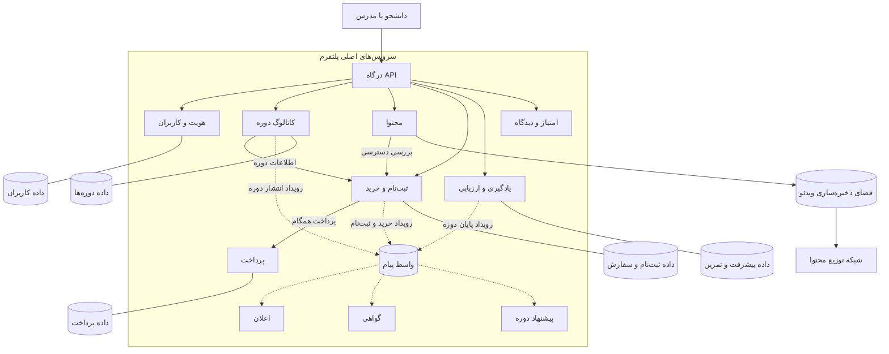
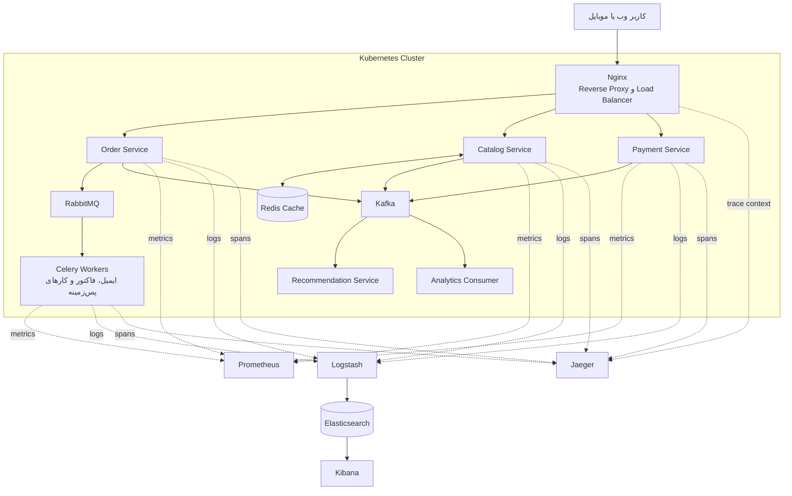

# پاسخ تمرین چهارم درس سیستم‌های توزیع‌شده

## بخش نظری

## ۱. تعریف مفاهیم

### ۱-۱. وابستگی دامنه‌ای (Domain Coupling)

به زبان ساده، وابستگی دامنه‌ای یعنی یک بخش از سیستم برای انجام کارش به بخش دیگری وابسته باشد. مثلاً اگر سرویس سفارش برای ثبت سفارش مجبور باشد جزئیات داخلی سرویس انبار را بداند، این دو سرویس به هم وابسته شده‌اند. کمی وابستگی طبیعی است، اما اگر با هر تغییر در انبار مجبور شویم سرویس سفارش را هم عوض کنیم، وابستگی بیش از حد شده است.

برای کمتر شدن این مشکل، هر سرویس باید منطق مربوط به کار خودش را نگه دارد. ارتباط سرویس‌ها هم بهتر است از راه یک رابط مشخص یا رویداد انجام شود. در این حالت هر سرویس فقط قرارداد سرویس دیگر را می‌شناسد و کاری به پیاده‌سازی داخلی آن ندارد.

### ۱-۲. تجزیه داده (Data Decomposition)

منظور از تجزیه داده این است که اطلاعات سیستم را بر اساس مسئولیت هر بخش جدا کنیم. مثلاً اطلاعات کاربران در اختیار سرویس کاربران باشد، سفارش‌ها را سرویس سفارش نگه دارد و تراکنش‌ها در سرویس پرداخت ذخیره شوند. به این ترتیب هر سرویس صاحب داده‌های خودش است.

این کار فقط به معنی ساختن چند دیتابیس جدا نیست. تقسیم داده باید با مرز واقعی کارهای سیستم هماهنگ باشد. همچنین یک سرویس نباید مستقیم سراغ جدول‌های سرویس دیگر برود و باید اطلاعات را از رابط یا رویداد آن بگیرد. این روش استقلال سرویس‌ها را بیشتر می‌کند، ولی گزارش‌گیری کلی و هماهنگ نگه داشتن داده‌ها کمی سخت‌تر می‌شود.

### ۱-۳. ارتباط رویدادمحور (Event-Driven Communication Pattern)

در ارتباط رویدادمحور، هر سرویس اتفاقی را که رخ داده اعلام می‌کند. لازم نیست بداند چه سرویس‌هایی از آن استفاده می‌کنند. مثلاً سرویس سفارش رویداد «سفارش ثبت شد» را منتشر می‌کند. بعد سرویس اعلان از روی آن ایمیل می‌فرستد و سرویس گزارش‌گیری هم آمار فروش را به‌روز می‌کند.

برای جابه‌جایی این رویدادها معمولاً از یک واسط پیام مانند Kafka یا RabbitMQ استفاده می‌شود. خوبی این روش آن است که سرویس‌ها کمتر به هم وابسته می‌شوند و لازم نیست همه کارها همان لحظه انجام شوند. البته مدیریت پیام تکراری، ترتیب پیام‌ها و خطاها سخت‌تر می‌شود و باید از قبل برای آن‌ها راه‌حل داشته باشیم.

## ۲. مشکل عملکرد فروشگاه آنلاین

مشکل اصلی این پروژه، تقسیم کردن خیلی زود سیستم به سرویس‌های کوچک است. تیم هنوز شناخت کاملی از کار فروشگاه نداشته، ولی از همان اول تعداد زیادی میکروسرویس ساخته است. نتیجه چنین کاری معمولاً سیستمی است که فقط ظاهر توزیع‌شده دارد؛ یعنی سرویس‌ها جدا دیده می‌شوند، اما برای انجام یک کار ساده باز هم به‌شدت به هم وابسته‌اند.

معماری میکروسرویس زمانی به درد می‌خورد که واقعاً به استقرار جدا، مقیاس‌پذیری مستقل یا تیم‌های مستقل نیاز داشته باشیم. در این پروژه هنوز چنین نیازی نبوده است. با این حال تیم از همان اول درگیر ارتباط شبکه، چند دیتابیس، خطاهای بین سرویس‌ها و تست‌های سراسری شده است. طبیعی است که با بیشتر شدن این دردسرها، سرعت توسعه هم پایین بیاید.

وابستگی زیاد رابط‌های سرویس‌ها هم نشان می‌دهد که مرزها درست انتخاب نشده‌اند. اگر برای یک تغییر ساده مجبور شویم چند سرویس را با هم تغییر دهیم و منتشر کنیم، عملاً استقلالی وجود ندارد. جدا بودن دیتابیس‌ها نیز به تنهایی کمکی نمی‌کند و حتی یک تراکنش ساده را به تراکنشی بین چند سرویس تبدیل می‌کند.

بهتر بود تیم کار را با یک برنامه یکپارچه ماژولار شروع کند. در این روش کل برنامه یک‌جا منتشر می‌شود، اما بخش‌هایی مثل کاتالوگ، سفارش، پرداخت و انبار در کد مرز مشخص دارند. هر بخش فقط از راه رابط تعریف‌شده با بخش دیگر حرف می‌زند. در نتیجه توسعه و تست ساده می‌ماند و تیم هم کم‌کم دامنه مسئله را بهتر می‌شناسد.

بعد از روشن شدن مرزهای واقعی کسب‌وکار، می‌توان بخش‌هایی را که واقعاً نیاز دارند جدا کرد. مثلاً اگر پرداخت شرایط امنیتی خاصی پیدا کرد یا کاتالوگ در زمان کمپین بار زیادی داشت، جدا کردن آن‌ها منطقی است. این جداسازی مرحله‌ای ریسک بسیار کمتری از ساخت تعداد زیادی سرویس در روز اول دارد.

## ۳. مقایسه ارتباط همگام و ناهمگام

در ارتباط همگام، سرویس فرستنده درخواست را می‌فرستد و منتظر جواب می‌ماند. رابط‌های REST و gRPC نمونه‌های رایج این روش هستند. این مدل برای کاری مناسب است که نتیجه آن باید همان لحظه به کاربر نشان داده شود. مشکلش این است که کندی یا خرابی سرویس مقصد، مستقیم روی درخواست کاربر اثر می‌گذارد.

در ارتباط ناهمگام، سرویس پیام را در یک واسط قرار می‌دهد و منتظر تمام شدن کار نمی‌ماند. سرویس گیرنده هر وقت آماده بود پیام را پردازش می‌کند. این روش وابستگی زمانی سرویس‌ها را کمتر می‌کند و برای بار زیاد بهتر است، اما جواب فوری نمی‌دهد. همچنین باید برای تلاش دوباره، پیام تکراری و صف خطا برنامه داشته باشیم.

مقایسه این دو روش بر اساس معیارهای سؤال به شکل زیر است:

| معیار | ارتباط همگام | ارتباط ناهمگام |
|---|---|---|
| میزان وابستگی (Coupling) | فرستنده باید مقصد و نوع پاسخ را بشناسد و به در دسترس بودن آن وابسته است. | تولیدکننده فقط شکل پیام را می‌شناسد و لازم نیست مصرف‌کننده‌ها را بشناسد. |
| زمان پاسخ (Latency) | جواب مستقیم برمی‌گردد، ولی در زنجیره فراخوانی‌ها زمان‌ها با هم جمع می‌شوند. | فرستنده زودتر آزاد می‌شود، ولی زمان پایان کار دقیق و فوری نیست. |
| تحمل خطا (Fault Tolerance) | خرابی مقصد روی درخواست اثر مستقیم دارد و باید زمان انتظار و قطع‌کننده مدار داشته باشیم. | واسط پیام را تا برگشت مصرف‌کننده نگه می‌دارد، ولی خود واسط هم باید پایدار باشد. |
| مقیاس‌پذیری (Scalability) | می‌توان تعداد نمونه‌های سرویس را زیاد کرد، ولی بار لحظه‌ای مستقیم به آن‌ها می‌رسد. | صف مانند بافر عمل می‌کند و می‌توان مصرف‌کننده‌ها را بر اساس حجم صف زیاد کرد. |
| سازگاری | برای عملیات نیازمند پاسخ فوری و سازگاری قوی ساده‌تر است. | معمولاً با سازگاری نهایی کار می‌کند و مشاهده نتیجه با کمی تأخیر انجام می‌شود. |

برای این فروشگاه بهتر است هر دو روش را کنار هم استفاده کنیم. هنگام پرداخت، کاربر باید همان لحظه بفهمد پرداخت موفق بوده یا نه؛ پس ارتباط سفارش با پرداخت می‌تواند همگام باشد. برای جلوگیری از پرداخت دوباره باید یک کلید یکتا برای درخواست داشته باشیم. زمان انتظار کوتاه و قطع‌کننده مدار هم کمک می‌کنند خرابی پرداخت، سرویس سفارش را برای مدت طولانی درگیر نکند.

بعد از پرداخت، فرستادن ایمیل لازم نیست کاربر را منتظر نگه دارد. سرویس سفارش رویداد OrderPaid را منتشر می‌کند و سرویس اعلان بعداً آن را می‌خواند. در این حالت اگر سرویس ایمیل موقتاً قطع باشد، خود خرید از بین نمی‌رود. الگوی Transactional Outbox هم کمک می‌کند ثبت پرداخت و انتشار رویداد از هم جا نمانند.

اگر جواب پرداخت لازم نباشد همان لحظه نمایش داده شود، خود پرداخت هم می‌تواند ناهمگام باشد. در این حالت سفارش ابتدا با وضعیت Pending ساخته می‌شود و بعد با رویداد موفق یا ناموفق تغییر می‌کند. پس کارهای کوتاه و تعاملی معمولاً همگام هستند و کارهای جانبی یا زمان‌بر بهتر است ناهمگام باشند.

## ۴. طراحی سامانه میکروسرویس پلتفرم آموزشی

### مرز سرویس‌ها و مسئولیت آن‌ها

مرز سرویس‌ها را بر اساس کارهای اصلی پلتفرم در نظر می‌گیرم، نه بر اساس جدول‌های دیتابیس. سرویس‌های پیشنهادی این‌ها هستند:

| سرویس | مسئولیت و داده‌های تحت مالکیت |
|---|---|
| هویت و کاربران | ثبت‌نام، ورود، نقش دانشجو و مدرس، پروفایل و مجوزها؛ مالک اطلاعات حساب کاربری است. |
| کاتالوگ دوره | مشخصات دوره، مدرس، دسته‌بندی، قیمت پایه و وضعیت انتشار؛ مالک اطلاعات قابل جست‌وجوی دوره است. |
| محتوا | فصل‌ها، ویدئوها و فایل‌های دوره؛ فایل اصلی را در فضای ذخیره‌سازی نگه می‌دارد و لینک امن برای CDN می‌سازد. |
| ثبت‌نام و خرید | سبد خرید، سفارش و دسترسی دانشجو به دوره؛ مالک وضعیت Enrollment است. |
| پرداخت | ارتباط با درگاه، ثبت تلاش‌های پرداخت، بازگشت وجه و نتیجه تراکنش مالی. |
| یادگیری و ارزیابی | پیشرفت تماشای درس‌ها، تمرین‌ها، پاسخ دانشجو و نمره؛ داده‌های پرتعداد فعالیت آموزشی را نگه می‌دارد. |
| گواهی | بررسی شرایط پایان دوره و تولید گواهی قابل اعتبارسنجی. |
| امتیاز و دیدگاه | ثبت امتیاز و نظر کاربران مجاز و محاسبه امتیاز تجمیعی هر دوره. |
| اعلان | ارسال ایمیل، پیامک یا اعلان درون‌برنامه‌ای بر اساس رویدادها. |
| پیشنهاد دوره | ساخت پیشنهاد شخصی بر اساس بازدید، خرید و پیشرفت کاربر. |

این فهرست به این معنی نیست که از روز اول باید ده پروژه جدا بسازیم. بخش‌های کم‌بار می‌توانند در شروع کنار هم باشند، ولی مرز کد و داده آن‌ها باید مشخص بماند. هر بخش را وقتی جدا می‌کنیم که واقعاً دلیل فنی یا کاری داشته باشد.

### مالکیت و تبادل داده

هر سرویس دیتابیس خودش را دارد و سرویس دیگری نباید مستقیم جدول‌های آن را بخواند. مثلاً وضعیت دسترسی دانشجو به یک دوره در سرویس ثبت‌نام نگه‌داری می‌شود و سرویس محتوا برای بررسی دسترسی از همان سرویس سؤال می‌کند. بعضی اطلاعات پرمصرف را می‌توان با رویداد در سرویس دیگر کپی کرد. برای نمونه، سرویس پیشنهاد با دریافت رویداد CourseViewed سابقه بازدید مورد نیاز خودش را می‌سازد.

### ارتباط بین سرویس‌ها

کارهایی مثل ورود، دیدن فهرست دوره‌ها، گرفتن لینک پخش و شروع پرداخت به جواب فوری نیاز دارند؛ پس ارتباط آن‌ها همگام است. درخواست‌ها ابتدا از درگاه API رد می‌شوند تا بررسی هویت، محدود کردن تعداد درخواست و مسیریابی در یک محل انجام شود. خود درگاه نباید منطق اصلی کسب‌وکار را اجرا کند.

اتفاق‌هایی مثل انتشار دوره، پرداخت موفق و تمام شدن دوره به صورت رویداد پخش می‌شوند. سرویس‌های اعلان، پیشنهاد و گواهی هرکدام رویداد مورد نیازشان را می‌گیرند. شکل رویدادها باید مشخص و نسخه‌بندی‌شده باشد. هر مصرف‌کننده هم باید طوری نوشته شود که دریافت دوباره یک پیام، نتیجه را خراب نکند.

### تراکنش خرید دوره

خرید دوره بین سرویس ثبت‌نام و پرداخت انجام می‌شود و یک تراکنش دیتابیسی مشترک ندارد. برای هماهنگ کردن این کار می‌توان از الگوی Saga استفاده کرد:

1. سرویس ثبت‌نام سفارش را با وضعیت در انتظار (Pending) می‌سازد.
2. سرویس پرداخت با یک کلید یکتا، تراکنش را در درگاه انجام می‌دهد.
3. در صورت موفقیت، رویداد PaymentSucceeded منتشر می‌شود و ثبت‌نام به حالت فعال (Active) می‌رود.
4. در صورت شکست، سفارش ناموفق (Failed) می‌شود. اگر پول گرفته شده باشد ولی دوره فعال نشود، مبلغ با عملیات جبرانی Refund برگردانده می‌شود.
5. پس از فعال شدن ثبت‌نام، اعلان رسید و دسترسی دوره به شکل ناهمگام انجام می‌شود.

هر سرویس تغییر دیتابیس و ثبت پیام Outbox را با هم انجام می‌دهد. سپس یک پردازش جدا پیام را به واسط پیام می‌فرستد. با این روش احتمال اینکه اطلاعات ذخیره شود ولی رویداد ارسال نشود، بسیار کمتر می‌شود.

### مقیاس‌پذیری و پایداری

سرویس‌ها بهتر است تا جای ممکن بدون وضعیت باشند تا بتوان چند نمونه از آن‌ها اجرا کرد. زمان انتشار یک دوره محبوب، فقط سرویس‌های کاتالوگ و محتوا بزرگ‌تر می‌شوند و لازم نیست همه سامانه را گسترش دهیم. ویدئو هم مستقیم از فضای ذخیره‌سازی و CDN پخش می‌شود و از داخل سرویس عبور نمی‌کند. اطلاعات دوره‌های محبوب نیز برای مدت کوتاه در حافظه نهان قرار می‌گیرد.

برای ارتباط همگام باید زمان انتظار، تلاش دوباره محدود و قطع‌کننده مدار داشته باشیم. برای پیام‌ها هم تلاش دوباره و صف پیام‌های خراب لازم است. نرخ خطا، زمان پاسخ و طول صف باید بررسی شوند. همچنین یک شناسه رهگیری همراه درخواست می‌فرستیم تا مسیر آن بین سرویس‌ها قابل پیدا کردن باشد.

### نمای کلی معماری پیشنهادی

در نمودار زیر، پیکان‌های معمولی ارتباط همگام و پیکان‌های خط‌چین ارتباط رویدادمحور را نشان می‌دهند. همچنین هر سرویس داده‌های مربوط به خودش را نگه می‌دارد.

## بخش پژوهشی

## ۵. ابزارهای مهم

### الف) Nginx

ابزار Nginx یک وب‌سرور و پراکسی معکوس سبک است که جلوی سامانه قرار می‌گیرد. این ابزار درخواست HTTPS را می‌گیرد و هر درخواست را به سرویس مناسب می‌فرستد. همچنین می‌تواند درخواست‌ها را بین چند نمونه از یک سرویس پخش کند.

مثال عملی آن در یک فروشگاه پربازدید است: درخواست‌های /api/catalog بین سه نمونه سرویس کاتالوگ پخش می‌شوند، در حالی که /api/payment به نمونه‌های سرویس پرداخت می‌رود. در نتیجه کاربر فقط یک آدرس عمومی می‌بیند و تغییر تعداد نمونه‌های داخلی برای او مشخص نیست.

### ب) Prometheus

ابزار Prometheus عددهای مربوط به وضعیت سامانه را جمع می‌کند. تعداد درخواست‌ها، نرخ خطا، زمان پاسخ و مصرف حافظه نمونه این عددها هستند. هر سرویس این اطلاعات را در یک نشانی مشخص می‌گذارد و Prometheus آن‌ها را در زمان‌های منظم می‌خواند. بعد می‌توان روی این اطلاعات نمودار و هشدار ساخت.

برای مثال اگر صدک ۹۵ زمان پاسخ سرویس پرداخت طی پنج دقیقه از دو ثانیه بیشتر شود، Prometheus می‌تواند هشدار را به Alertmanager بفرستد. تیم عملیات با دیدن هم‌زمان نرخ خطا و مصرف CPU تشخیص می‌دهد مشکل از کمبود منابع است یا از درگاه بانکی.

### پ) RabbitMQ

ابزار RabbitMQ یک واسط پیام است و برای ساخت صف کار استفاده می‌شود. فرستنده پیام را به Exchange می‌دهد و پیام بر اساس قانون‌های تعیین‌شده وارد یک یا چند صف می‌شود. قابلیت‌هایی مثل تأیید دریافت، تلاش دوباره و صف خطا کمک می‌کنند پیام‌های مهم با خرابی موقت یک سرویس از بین نروند.

یک مثال واقعی، صف ارسال ایمیل پس از خرید است. سرویس سفارش پیام را در صف قرار می‌دهد و چند Worker ایمیل‌ها را مصرف می‌کنند. اگر سرویس ایمیل برای چند دقیقه قطع شود، سفارش‌ها همچنان ثبت می‌شوند و پیام‌ها تا زمان برگشت Worker در صف می‌مانند.

### ت) Celery

ابزار Celery یک صف کار برای برنامه‌های پایتون است. خود این ابزار پیام‌ها را نگه نمی‌دارد و برای این کار به RabbitMQ یا Redis نیاز دارد. پردازشگرهای Celery کارهای زمان‌بر و زمان‌بندی‌شده را در پس‌زمینه انجام می‌دهند تا درخواست کاربر معطل نشود.

برای مثال پس از پایان دوره، API فقط درخواست ساخت گواهی را ثبت می‌کند. یک Worker در پس‌زمینه PDF گواهی را می‌سازد، آن را در فضای فایل ذخیره می‌کند و نتیجه را برمی‌گرداند. با زیاد شدن درخواست‌ها می‌توان تعداد Workerها را افزایش داد، بدون آنکه نمونه‌های API را بی‌دلیل زیاد کنیم.

### ث) ELK

مجموعه ELK از Elasticsearch، Logstash و Kibana ساخته شده است. بخش Logstash لاگ‌ها را جمع و مرتب می‌کند، بخش Elasticsearch آن‌ها را نگه می‌دارد و بخش Kibana برای جست‌وجو و دیدن نمودارهاست. معمولاً ابزاری مثل Filebeat هم لاگ کانتینرها را به این مجموعه می‌فرستد.

مثلاً وقتی کاربری گزارش می‌دهد پرداخت او موفق بوده ولی سفارش فعال نشده است، پشتیبان با جست‌وجوی order_id یا trace_id در Kibana، لاگ سرویس سفارش و پرداخت را کنار هم می‌بیند و نقطه شکست را پیدا می‌کند. این کار بسیار سریع‌تر از ورود جداگانه به هر سرور و خواندن فایل لاگ است.

### ج) Redis

ابزار Redis یک مخزن داده بسیار سریع در حافظه است. بیشتر از آن برای حافظه نهان، نشست کاربر، شمارنده و محدود کردن تعداد درخواست‌ها استفاده می‌شود. برای داده‌ها باید زمان انقضا گذاشت تا حافظه بی‌دلیل پر نشود. همچنین بهتر است اطلاعات اصلی پرداخت را فقط در Redis نگه نداریم.

در یک پلتفرم آموزشی، مشخصات دوره‌های محبوب با الگوی Cache-Aside برای چند دقیقه در Redis قرار می‌گیرد. در کمپین، بیشتر درخواست‌ها از cache پاسخ می‌گیرند و فشار روی دیتابیس کاتالوگ کم می‌شود. پس از ویرایش دوره نیز کلید مربوط حذف می‌شود تا اطلاعات قدیمی مدت زیادی نمایش داده نشود.

### چ) Kubernetes

ابزار Kubernetes اجرای برنامه‌های کانتینری را مدیریت می‌کند. ما وضعیت دلخواه را مشخص می‌کنیم و این ابزار Podها را اجرا می‌کند، نمونه خراب را جایگزین می‌کند و نسخه جدید را به‌تدریج بالا می‌آورد. بخش مقیاس‌دهی خودکار هم می‌تواند تعداد نمونه‌ها را بر اساس مصرف منابع تغییر دهد.

مثلاً هنگام شروع یک کمپین، تعداد Podهای سرویس کاتالوگ از ۳ به ۱۵ افزایش پیدا می‌کند، اما سرویس کم‌مصرف گواهی روی همان ۲ Pod می‌ماند. اگر یک Pod از کار بیفتد، Deployment نمونه دیگری ایجاد می‌کند و Service ترافیک را فقط به Podهای آماده می‌فرستد.

### ح) Kafka

ابزار Kafka برای نگه‌داری و پخش جریان رویدادها ساخته شده است. رویدادها در Topicهای بخش‌بندی‌شده باقی می‌مانند و چند گروه می‌توانند هرکدام با سرعت خودشان آن‌ها را بخوانند. تفاوت مهم Kafka با صف معمولی این است که رویداد بعد از خوانده شدن فوری پاک نمی‌شود و می‌توان دوباره آن را خواند.

یک مثال مناسب، جریان رفتار کاربران فروشگاه است. رویدادهای ProductViewed، AddedToCart و OrderPaid وارد Kafka می‌شوند. یک گروه آن‌ها را برای پیشنهاد محصول، گروه دیگر برای کشف تقلب و گروه سوم برای انبار داده مصرف می‌کند. اگر الگوریتم پیشنهاد تغییر کند، می‌توان رویدادهای قبلی را دوباره پردازش کرد.

### خ) Jaeger

ابزار Jaeger برای دنبال کردن مسیر درخواست بین سرویس‌ها استفاده می‌شود. هر درخواست یک trace دارد و هر قسمت از کار آن یک span است. با فرستادن شناسه رهگیری بین سرویس‌ها می‌توان فهمید درخواست از کجا رد شده و هر مرحله چقدر طول کشیده است. معمولاً این اطلاعات با OpenTelemetry جمع می‌شوند و برای نمایش به Jaeger می‌روند.

برای مثال در فرایند خرید، یک trace شامل Nginx، سرویس سفارش، سرویس پرداخت و دیتابیس است. اگر کل درخواست چهار ثانیه طول کشیده باشد، نمای waterfall در Jaeger نشان می‌دهد سه ثانیه آن صرف پاسخ درگاه پرداخت شده و مشکل از سرویس سفارش نیست.

### دیاگرام سطح بالای معماری

در دیاگرام زیر همه ابزارهای خواسته‌شده در یک فروشگاه آنلاین میکروسرویسی به کار رفته‌اند. RabbitMQ برای صف کارهای اجرایی کوتاه و Kafka برای جریان رویدادهای قابل بازخوانی استفاده شده است؛ بنابراین نقش این دو ابزار با هم تداخل ندارد.

